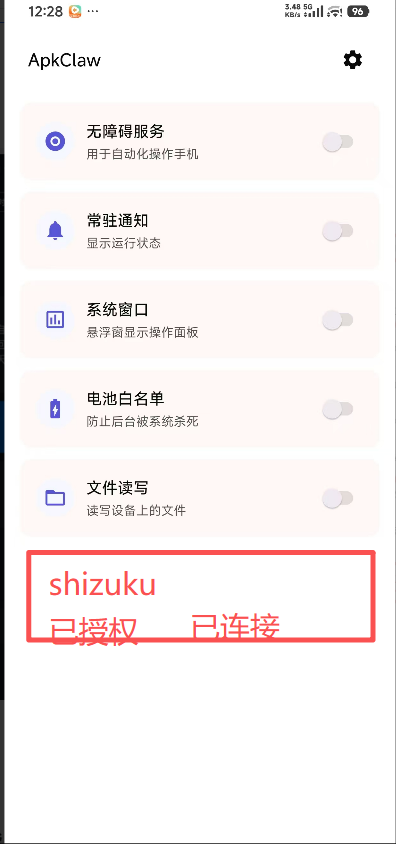
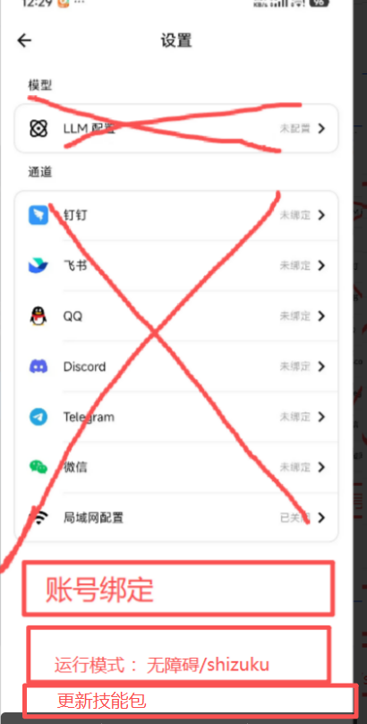
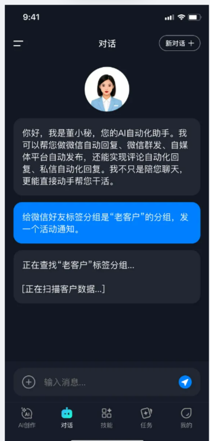
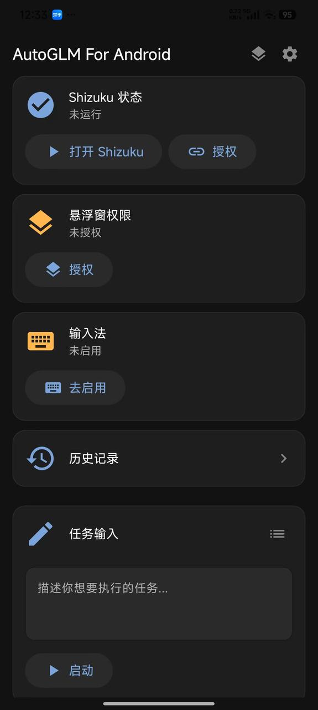

# Apkclaw 二开

## 1、项目地址

| 项目 | 地址 |
|------|------|
| Apkclaw | https://github.com/apkclaw-team/ApkClaw |
| AutoGLM For Android | https://github.com/Luokavin/AutoGLM-For-Android |

## 2、ApkClaw 二开功能

AutoGLM 靠 Shizuku 更稳、不依赖无障碍被系统杀后台；Apkclaw 纯无障碍，适配更广但受系统后台限制更大。

### 对比说明

| 对比维度 | ApkClaw 二开 | 本次二开功能 | 参考 AutoGLM For Android |
|----------|--------------|--------------|---------------------------|
| 设备操作 | 无障碍服务手势 `dispatchGesture`、UI 节点遍历、全局按键 | Shizuku 执行 Shell、截图、点击滑动 | Shizuku 执行 Shell、截图、点击滑动 |
| 权限方案 | 无障碍服务 `AccessibilityService` 为核心，依赖系统无障碍权限 | Shizuku 授权，无 Root 也可高阶操作 | Shizuku 授权，无 Root 也可高阶操作 |
| 运行模式 | 后台常驻服务 + 悬浮球，支持跨设备远程发指令控制手机 | 单机手机内独立运行，本地悬浮窗交互 | — |
| LLM 框架 | 基于 LangChain4j 标准 Agent 框架，工具调用标准化 | 自研 Agent 流程，无第三方 Agent 框架依赖 | — |
| 控制入口 | 钉钉/飞书/QQ 等外部聊天渠道发消息即可控制 | 增加一个自己的 App 渠道，绑定一个账号即可，接受 App 下发任务 | APP 内直接输入自然语言任务 |
| 任务能力 | 完整 Agent 循环：观察→思考→行动→验证，死循环检测、自动重试 | 单步自然语言任务、任务模板、历史记录 | — |
| 最低安卓版本 | Android 9.0 (API 28) | 兼容小米、华为、OPPO | Android 7.0 (API 24) |
| 架构复杂度 | Kotlin 为主 | Kotlin 为主 | — |
| 多模型支持 | 兼容 OpenAI/Anthropic，可自定义 BaseURL 适配第三方 | 参数配置从服务器获取，不要手动设置 | 兼容 OpenAI 格式视觉模型，适配智谱 AutoGLM-Phone |
| 技能 skill | 不支持 | Markdown 格式 skill，从服务器下载保存本地，根据任务调用（任务中指定使用哪个技能包）。目前实现：微信 skill，消息发送和自动回复 | 不支持 |

## 3、界面示意

左是我们另外一个 App 用户下发任务，右侧是参考 AutoGLM For Android。

